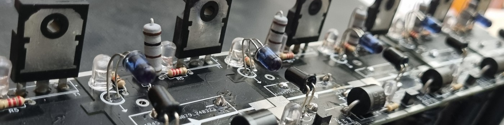

## 
 Welcome to my GitHub Profile 😀 

---

---

### 🚀 About Me

---

### 🔧 Technologies & Tools

---

<h3 align="left">🛠 Language and tools</h3>

###

  
  
  
  
  
  
  
  
  
  
  
  
  
  
  
  
  
  
  
  
  
  
  
  
  
  
  

###

### 📊 GitHub Stats

  
  

---

### 🌟 Featured Projects
.

---

### 🏆 Achievements

---

### 🌱 Currently Learning

---

### 📈 Contribution Graph

  

### 📫 Let's Connect
- Email: <nithinmathewjoji@gmail.com>
- Portfolio Website: 

###

  
  
  
  
  

###

---

